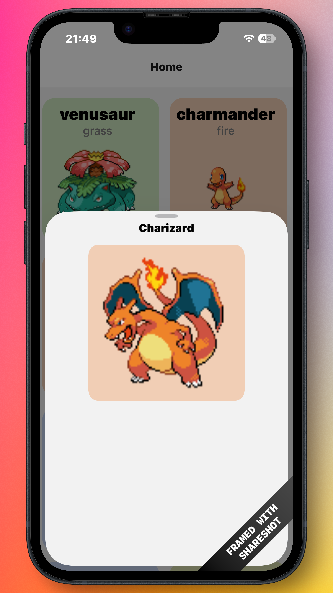
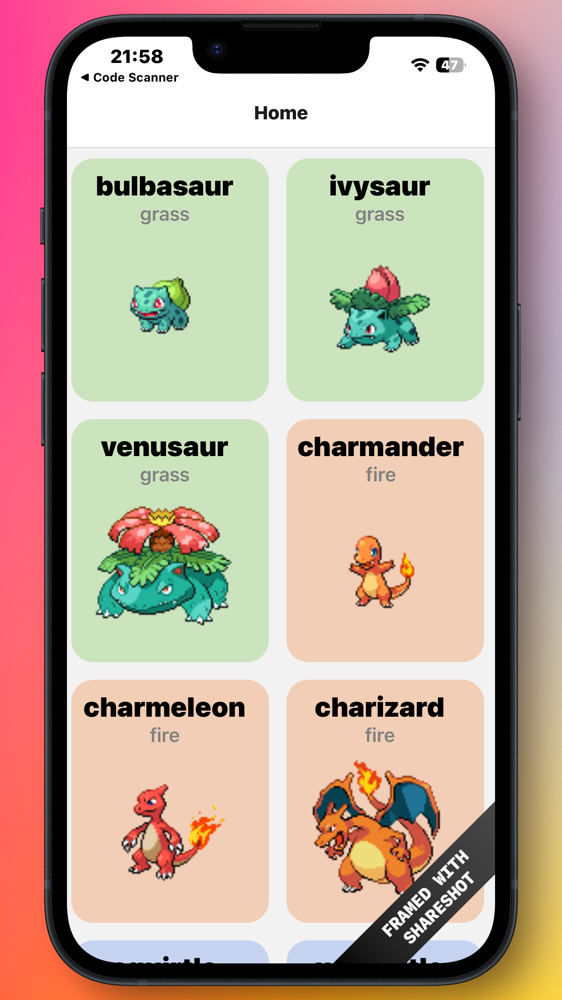

# 📱 Pokédex App

A beginner-friendly mobile app that displays a list of Pokémon with their details, types, and images. Built with **React Native** and **Expo**.


---

## 🎯 What is This Project?

This is a **Pokédex application** - a digital encyclopedia of Pokémon! It lets you:
- 👀 Browse a list of Pokémon with their images
- 🎨 See Pokémon by their type with color-coded categories
- 📖 View detailed information about each Pokémon
- 📱 Use it on iOS, Android, or Web

**Perfect for beginners** learning React Native and mobile app development!

---

## ✨ Features

- **Pokémon List**: View 50 Pokémon cards with images and type information
- **Type-Based Colors**: Each Pokémon type has its own color for quick identification
- **Detailed View**: Tap any Pokémon to see more information
- **Cross-Platform**: Works on iOS, Android, and Web
- **Real API**: Uses the free [PokéAPI](https://pokeapi.co/) to fetch live data

---

## 📸 Screenshots

### Pokémon Detail Screen
Browse through all available Pokémon with beautiful type-based color coding.  
<p align="center">
  
</p>

### Home Screen
Tap any Pokémon to see more detailed information about it with a larger image view.  
<p align="center">
  
</p>

---

## 📋 Prerequisites

Before you start, make sure you have:

1. **Node.js** (version 14 or higher)
   - Download from: https://nodejs.org/
   - Verify installation: Open terminal/command prompt and type `node --version`

2. **npm or pnpm** (comes with Node.js)
   - Verify: Type `npm --version` in terminal

3. **Expo CLI** (optional, but helpful)
   - Install with: `npm install -g expo-cli`

4. **A code editor** like VS Code
   - Download from: https://code.visualstudio.com/

---

## 🚀 Getting Started

### 1. **Clone or Download the Project**

```bash
# If you have git installed:
git clone <https://github.com/Drco-code/pokedox.git>
cd pokedex

# Or download the ZIP file and extract it
```

### 2. **Install Dependencies**

Open a terminal in the project folder and run:

```bash
npm install
# or if you use pnpm:
pnpm install
```

This downloads all the required packages listed in `package.json`.

### 3. **Start the App**

```bash
npm start
# or:
npx expo start
```

You'll see options in the terminal to run on different platforms.

---

## 🏃 Running the App

After running `npm start`, you can test the app in different ways:

### **Option 1: Expo Go (Easiest for Beginners)**
1. Download **Expo Go** app on your phone from App Store or Google Play
2. Scan the QR code shown in terminal with Expo Go
3. The app opens on your phone!

### **Option 2: iOS Simulator** (Mac only)
```bash
npm run ios
```

### **Option 3: Android Emulator** (Windows/Mac/Linux)
```bash
npm run android
```

### **Option 4: Web Browser**
```bash
npm run web
```

---

## 📁 Project Structure

Here's what each folder does:

```
pokedex/
├── app/                    # 📱 App screens and pages
│   ├── _layout.tsx        # App layout wrapper
│   ├── index.tsx          # Home page (list of Pokémon)
│   └── pokemon_details.tsx # Detail page (single Pokémon info)
│
├── services/              # 🔌 API calls
│   └── pokemonApi.ts      # Functions to fetch Pokémon data
│
├── constants/             # ⚙️ Fixed values
│   └── pokemonColors.ts   # Colors for each Pokémon type
│
├── hooks/                 # 🪝 Custom React hooks
│   └── usePokemon.ts      # Hook to fetch and manage Pokémon data
│
├── types/                 # 📝 TypeScript type definitions
│   └── pokemon.ts         # Pokémon data type structure
│
├── assets/                # 🖼️ Images and icons
│
├── package.json           # 📦 Project dependencies
├── tsconfig.json          # ⚙️ TypeScript config
└── app.json               # 📱 Expo app configuration
```

---

## 🔧 Key Technologies

| Technology | Purpose |
|-----------|---------|
| **React Native** | Build mobile apps with JavaScript/React |
| **Expo** | Framework that makes React Native easier |
| **TypeScript** | JavaScript with type safety (catches errors early) |
| **Expo Router** | Navigation between screens |
| **PokéAPI** | Free API with Pokémon data |

---

## 💡 How It Works

### **Simple Flow:**

1. **App Starts** → Shows home screen (`index.tsx`)
2. **Home Screen** → Fetches 50 Pokémon from PokéAPI using `fetchPokemons()`
3. **Display List** → Shows Pokémon cards with colors based on their type
4. **Tap a Card** → Navigate to details page with that Pokémon's info

### **Key Files Explained:**

- `services/pokemonApi.ts` - Makes requests to PokéAPI
- `app/index.tsx` - Shows the Pokémon list
- `app/pokemon_details.tsx` - Shows details about one Pokémon
- `hooks/usePokemon.ts` - Custom hook that handles fetching data

---

## 🌐 API Used

This app fetches data from the **free** [PokéAPI](https://pokeapi.co/):

```
https://pokeapi.co/api/v2/pokemon
```

No API key needed! It's completely open and free to use.

---

## 📚 Learning Resources

**New to React Native or Expo?** Check these out:

- [Expo Documentation](https://docs.expo.dev/) - Official guides
- [React Native Docs](https://reactnative.dev/) - React Native basics
- [TypeScript Handbook](https://www.typescriptlang.org/docs/) - TypeScript for beginners
- [PokéAPI Documentation](https://pokeapi.co/docs/v2) - Pokémon API docs
- [Expo Router Guide](https://docs.expo.dev/router/introduction/) - Navigation in Expo

---

## 🐛 Common Issues & Solutions

### **"npm: command not found"**
- Node.js isn't installed. Download it from https://nodejs.org/

### **Port 8081 is already in use**
```bash
# Try a different port:
npx expo start --port 8082
```

### **QR code not scanning**
- Make sure Expo Go app is installed
- Make sure phone and computer are on same WiFi
- Try entering the URL directly in Expo Go instead

### **API not working / No Pokémon showing**
- Check your internet connection
- Make sure PokéAPI is online: https://pokeapi.co/
- Check browser console for errors (F12)

### **"Cannot find module" error**
- Run `npm install` again to make sure all dependencies are installed
- Delete `node_modules` folder and `pnpm-lock.yaml` (or `package-lock.json`), then run `npm install` again

---

## 📝 Available Scripts

```bash
npm start          # Start the dev server
npm run ios        # Run on iOS simulator
npm run android    # Run on Android emulator
npm run web        # Run in web browser
npm run lint       # Check code for errors
```

---

## 🎓 Beginner Tips

1. **Start Small** - Read `app/index.tsx` first to understand the flow
2. **Use Console** - Add `console.log()` to see what's happening
3. **Try Changes** - Modify colors, add Pokémon, experiment!
4. **Read Errors** - Errors tell you what's wrong and where
5. **Use DevTools** - Press `i` (iOS) or `a` (Android) in terminal while app runs

---

## 🚀 Next Steps (Ideas to Learn More)

Here are some ideas to expand your app and learn more:

- Add search functionality to find Pokémon by name
- Add a favorites system to save liked Pokémon
- Show all 1000+ Pokémon with pagination or infinite scroll
- Display Pokémon stats (Attack, Defense, HP, etc.)
- Create a Pokémon comparison feature
- Add filters by type
- Implement dark mode

---

## 📄 License

This project is open source and available for educational purposes.

---

## 🤝 Questions or Stuck?

Here's what to do:

1. **Check the console** - Open DevTools (F12) and look for red errors
2. **Read the error message** - It usually tells you exactly what's wrong
3. **Check file paths** - Make sure imports match actual file locations
4. **Search online** - Google the error message, others probably had it too
5. **Expo Docs** - Check https://docs.expo.dev for detailed guides

---

## 🎉 Happy Coding!

You're building a real mobile app! This is a great project to learn from. Don't worry about getting things perfect—focus on understanding how the pieces fit together.

Good luck, and have fun catching all those Pokémon! 🎮

---

**Made with ❤️ by a beginner developer**
